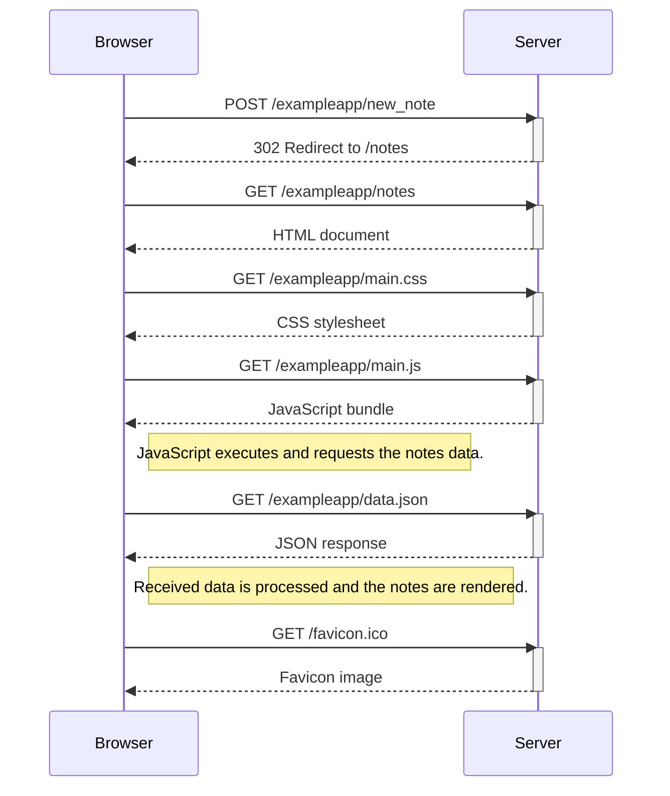

```mermaid
    sequenceDiagram
        participant Browser
        participant Server

        Browser->>Server: POST /exampleapp/new_note
        activate Server
        Server-->>Browser: 302 Redirect to /notes
        deactivate Server

        Browser->>Server: GET /exampleapp/notes
        activate Server
        Server-->>Browser: HTML document
        deactivate Server

        Browser->>Server: GET /exampleapp/main.css
        activate Server
        Server-->>Browser: CSS stylesheet
        deactivate Server

        Browser->>Server: GET /exampleapp/main.js
        activate Server
        Server-->>Browser: JavaScript bundle
        deactivate Server

        Note right of Browser: JavaScript executes and requests the notes data.

        Browser->>Server: GET /exampleapp/data.json
        activate Server
        Server-->>Browser: JSON response
        deactivate Server

        Note right of Browser: Received data is processed and the notes are rendered.

        Browser->>Server: GET /favicon.ico
        activate Server
        Server-->>Browser: Favicon image
        deactivate Server
```
